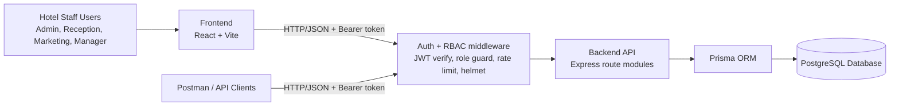

# System Architecture

The Manor Hotel CRM uses a 3-tier architecture:

- Presentation Layer: React frontend
- Application Layer: Node.js + Express API
- Data Layer: PostgreSQL via Prisma ORM

## Architecture Diagram (Mermaid)

## Main Modules

- Authentication and role-based access control (admin-provisioned staff accounts only -
  see the RBAC permission matrix in the root `README.md`)
- Customer profile management
- Room and reservation management
- Billing (invoices and payments)
- Complaints and service recovery
- Guest interaction log
- Campaign and recipient tracking
- Loyalty points transactions
- Staff/user administration
- KPI dashboard metrics

## Security layer

Every request (other than `/health` and `POST /auth/login`) passes through:

1. **Rate limiting** on the `/auth` router to slow credential-stuffing attempts.
2. **JWT verification** - the token's `sub` claim is re-checked against the database on
   every request, so a deactivated account loses access immediately rather than waiting
   for its token to expire.
3. **Role guard** (`requireRole`) - per-route allow-lists enforce the RBAC matrix.
4. **helmet** - standard HTTP security headers.
5. **Centralized error handling** - Prisma errors (unique constraint, not found, foreign
   key violation) are mapped to the correct HTTP status instead of leaking stack traces.
