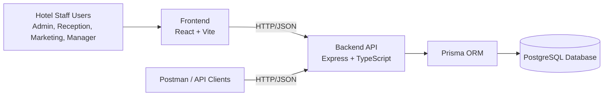

# System Architecture

The Manor Hotel CRM uses a 3-tier architecture:

- Presentation Layer: React frontend
- Application Layer: Node.js + Express API
- Data Layer: PostgreSQL via Prisma ORM

## Architecture Diagram (Mermaid)

## Main Modules

- Authentication and role-based access
- Customer profile management
- Room and reservation management
- Billing (invoices and payments)
- Complaints and service recovery
- Campaign and recipient tracking
- Loyalty points transactions
- KPI dashboard metrics
