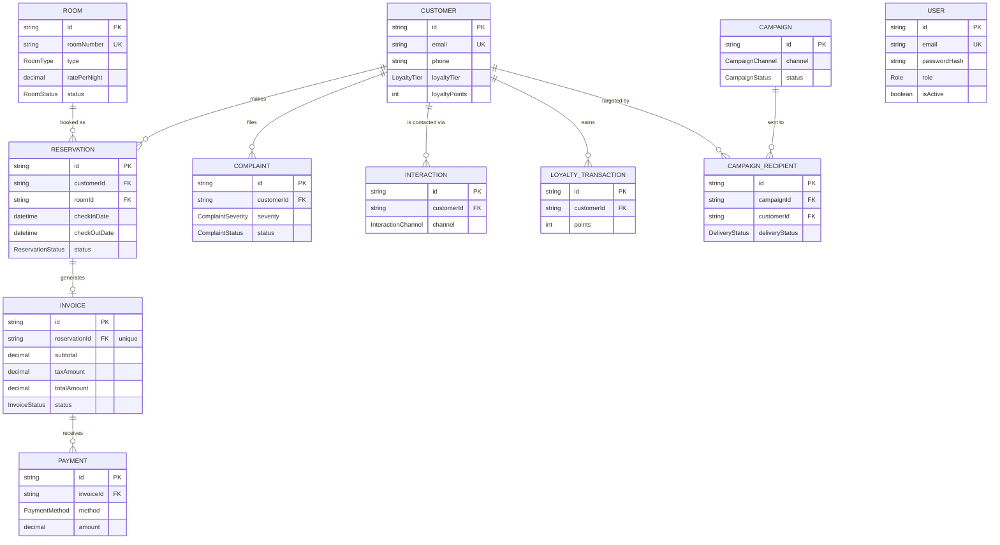
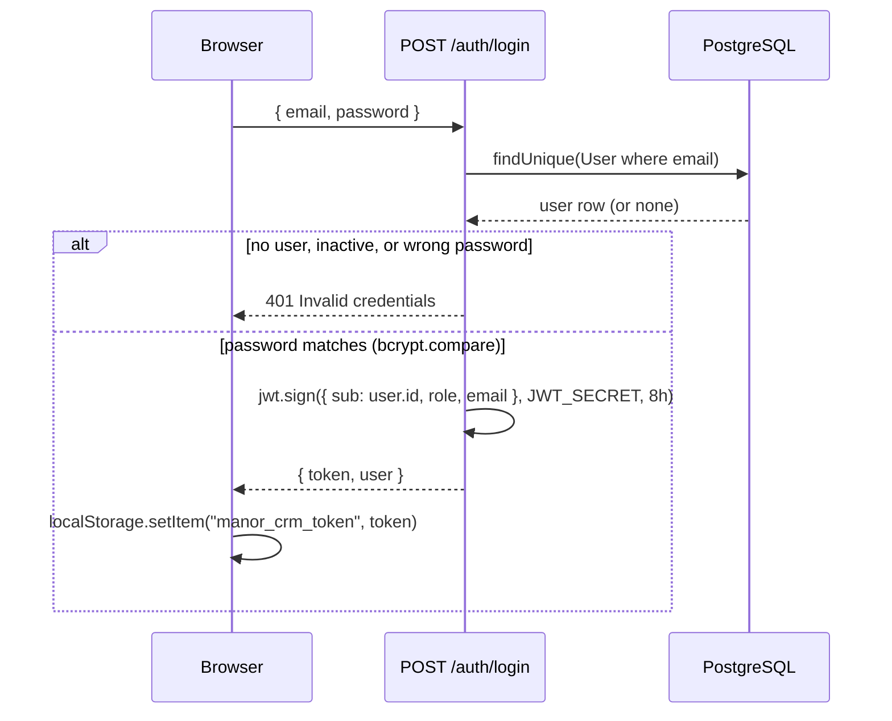
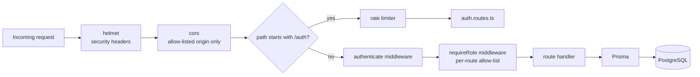
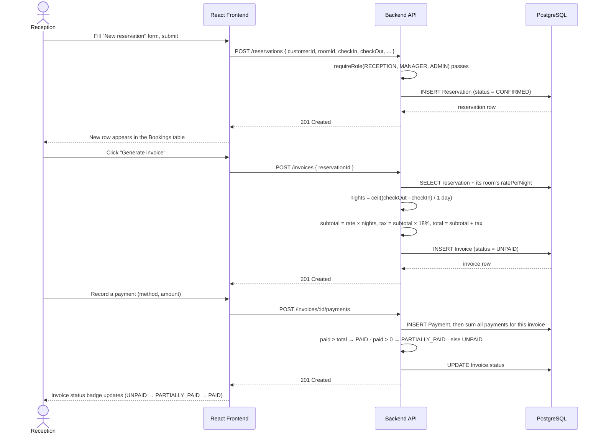
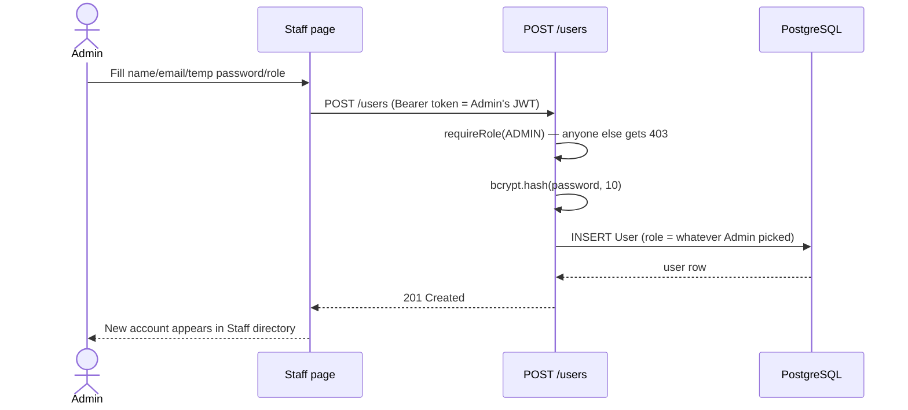
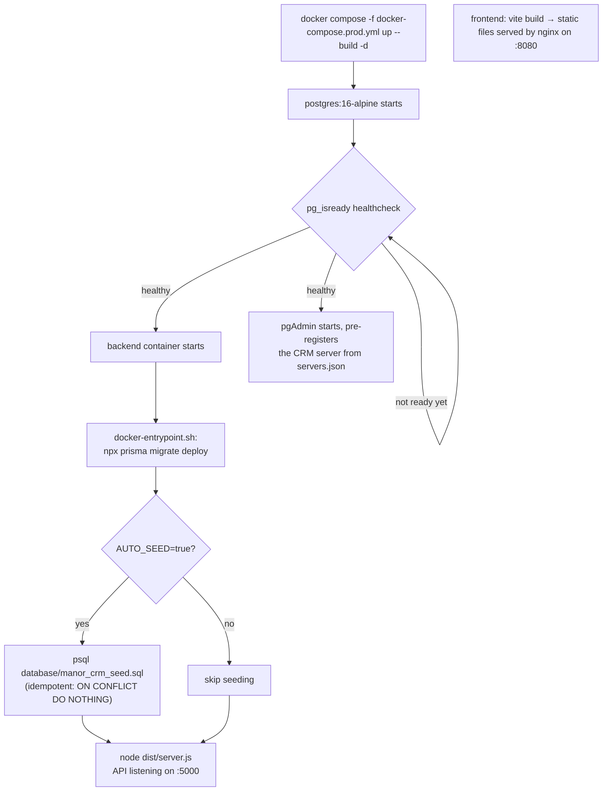

# The Manor Hotel CRM — System Documentation

This document explains **how the system actually works**: the technology stack and why each
piece was chosen, the layered architecture, the database design, and — most importantly — the
end-to-end *flow* of data for the operations that matter (signing in, enforcing roles, booking a
stay, billing a guest). Read this alongside `docs/API.md` (endpoint reference), `docs/ARCHITECTURE.md`
(high-level diagram + security layer) and `docs/PROJECT_STRUCTURE.md` (file layout).

---

## 1. What the system is

A CRM for a single hotel property ("The Manor Hotel") used internally by hotel staff — there is
no public-facing guest portal. Four kinds of staff use it, each with a different slice of the
system:

| Role | Job in the hotel | What they use the CRM for |
| --- | --- | --- |
| `RECEPTION` | Front desk | Guest profiles, rooms, reservations, billing, complaints |
| `MARKETING` | Marketing team | Campaigns, loyalty points |
| `MANAGER` | Operations manager | Everything reception + marketing can do |
| `ADMIN` | System administrator | Everything, plus creating/deactivating staff accounts |

There is deliberately **no self-service sign-up** — see §4. An `ADMIN` provisions every account.

---

## 2. The stack, and why each piece is there

| Layer | Technology | Why this one |
| --- | --- | --- |
| Frontend | **React + TypeScript + Vite** | Vite gives near-instant dev reloads; TypeScript catches whole classes of bugs (wrong field names, wrong roles) before runtime — valuable when the same `Role` type is checked in dozens of places. |
| Routing | **React Router** | Nested routes map cleanly onto "authenticated vs not" and "this role vs not" gates (`ProtectedRoute`, `RoleRoute` — see §7). |
| Backend | **Node.js + Express + TypeScript** | Express is minimal and explicit — every middleware in the request pipeline is visible in `app.ts` (§6), which matters for explaining *exactly* how a request is authenticated and authorized, a core requirement for a CRM handling guest and payment data. |
| ORM | **Prisma** | Generates a fully-typed database client from `schema.prisma` (§3) — a typo'd column name or wrong type is a compile error, not a runtime surprise. `prisma migrate` also gives a reviewable, versioned history of every schema change (`backend/prisma/migrations/`). |
| Database | **PostgreSQL** | Free, open-source, industry-standard relational database — a correct fit for data that is inherently relational (a Reservation *belongs to* a Customer *and* a Room; an Invoice *belongs to* a Reservation). |
| Auth | **JWT (jsonwebtoken) + bcrypt** | Stateless tokens mean the API doesn't need a server-side session store; bcrypt is the standard for password hashing (§4). |
| Security middleware | **helmet, express-rate-limit** | helmet sets standard hardening HTTP headers; rate-limiting slows credential-stuffing against `/auth/login`. |
| Validation | **zod** | Every request body is parsed against a schema before touching the database — malformed input never reaches Prisma. |
| Testing | **Vitest** | Fast, TypeScript-native; used for the RBAC guard and error-mapping middleware (`backend/src/middleware/*.test.ts`), run in CI. |
| Containers | **Docker + Docker Compose** | One command reproduces the entire stack identically on any machine — see §8. |
| DB GUI | **pgAdmin** (containerized) | Lets anyone — a lecturer, a teammate — inspect real tables and rows without installing anything or knowing SQL. |

Every item above is free and open-source — a hard requirement for this project.

---

## 3. Database design



Notes on the design:

- **`User` is intentionally isolated** — no foreign keys connect it to guest-facing tables. Staff
  identity and guest/business data are separate concerns; a staff account being deleted can never
  cascade into deleting reservations or invoices.
- **`Invoice.reservationId` is unique** — a reservation has at most one invoice, generated on
  demand (§5.3), not automatically at booking time.
- **`Complaint.assignedToId`** is a plain string, not a Prisma relation to `User` — a deliberate
  simplification (it's a label, not an enforced foreign key) rather than an oversight; a real
  next iteration would make it a proper relation.
- All monetary columns are `Decimal(10,2)` (via `@db.Decimal`), never `Float` — avoids
  floating-point rounding errors in money math (see §5.3's tax calculation).

---

## 4. Authentication flow



The frontend never stores a password — only the signed JWT. `AuthContext` decodes the token
client-side (`atob` on the payload segment) purely to render the user's name/role in the UI; the
decoded role is **never trusted for access control** — every protected action is re-checked
server-side (§5), because a client-side check is trivially bypassable.

**Why there's no `/auth/register`:** earlier versions of this project had a public sign-up form
that let anyone choose their own role — including `ADMIN`. That's a critical RBAC hole for a
system that gates money (billing) and guest data behind roles. It was removed; see §5.4.

---

## 5. Authorization (RBAC) flow

Every request (other than `/health` and `POST /auth/login`) passes through the same middleware
chain, wired up once in `backend/src/app.ts`:



### 5.1 `authenticate` (backend/src/middleware/auth.ts)

1. Reads the `Authorization: Bearer <token>` header — missing header → `401`.
2. `jwt.verify(token, JWT_SECRET)` — invalid/expired signature → `401`.
3. **Re-fetches the user from the database by the token's `sub` claim** and checks `isActive`.
   This is the important part: it means deactivating a staff account (Staff page → Deactivate)
   revokes access **immediately**, on the very next request — not eight hours later when the
   token would otherwise expire. A JWT alone can't do this; the DB check is what makes it real.
4. Attaches `req.user = { sub, role, email }` for downstream middleware.

### 5.2 `requireRole(...roles)` (same file)

A tiny factory: `requireRole(Role.ADMIN)` returns middleware that checks
`roles.includes(req.user.role)`, responding `403` if not. Every route file composes this per
endpoint — e.g. `roomsRouter.post("/", requireRole(...MANAGEMENT), ...)`. The full matrix of
who can do what is in the README's RBAC table and mirrors 1:1 with the `frontend/src/rbac.ts`
constants used to hide nav links/routes the current user can't use anyway (a UX nicety — the
backend guard is the actual security boundary, not the hidden nav link).

### 5.3 Worked example: booking a stay and billing it



This is a real, tested flow — not hypothetical: generating an invoice for a 3-night SUITE
booking at $180/night produces subtotal $540.00, tax $97.20, total $637.20; a $100 payment moves
its status to `PARTIALLY_PAID`.

### 5.4 Staff provisioning (the RBAC fix, in detail)



Contrast this with the old, removed flow: a public `/auth/register` endpoint accepted a `role`
field straight from an unauthenticated request body. Now, the **only** way a `role` field reaches
the database is through this admin-gated endpoint — closing the hole completely rather than
patching around it (e.g. by "hiding" the role picker in the UI while leaving the backend open,
which would have been security theater).

---

## 6. Backend request pipeline (code map)

```
backend/src/
  app.ts               ← assembles the middleware chain above, mounts every router
  server.ts             ← just calls createApp().listen()
  rbac.ts               ← shared role-group constants (FRONT_DESK, MARKETING_TEAM, ...)
  lib/
    env.ts               ← validated environment variables (fails fast if missing)
    prisma.ts            ← the one PrismaClient instance, shared everywhere
    asyncHandler.ts       ← wraps async route handlers so a thrown/rejected error
                            reaches errorHandler instead of hanging the request
  middleware/
    auth.ts               ← authenticate + requireRole (§5.1, §5.2)
    errorHandler.ts        ← maps Prisma error codes to HTTP status (P2002 → 409,
                            P2025 → 404, P2003 → 400) instead of leaking stack traces
    rateLimit.ts           ← limits POST /auth/* to 20 requests / 15 min per IP
  routes/
    auth.routes.ts, users.routes.ts, customers.routes.ts, rooms.routes.ts,
    reservations.routes.ts, invoices.routes.ts, complaints.routes.ts,
    interactions.routes.ts, campaigns.routes.ts, loyalty.routes.ts,
    dashboard.routes.ts    ← one file per resource; each declares its own
                            requireRole() calls per endpoint
```

Every route handler follows the same shape: `zod` schema validates the body → Prisma does the
database work → response. Errors (bad input → `400`; Prisma constraint violations → mapped by
`errorHandler`) never crash the process — `asyncHandler` guarantees that.

---

## 7. Frontend architecture

```
frontend/src/
  main.tsx → App.tsx        ← route tree
  auth/AuthContext.tsx       ← holds the JWT, decodes it client-side for display only,
                              exposes login()/logout(), attaches the token to every
                              outgoing request via api.ts
  api.ts                     ← thin fetch wrapper: adds Authorization header, throws
                              ApiError on non-2xx, calls the "unauthorized" handler
                              (which logs the user out) on any 401
  rbac.ts                    ← FRONT_DESK / MARKETING_TEAM / MANAGEMENT / ADMIN_ONLY
                              role-group arrays, mirroring the backend's rbac.ts
  components/
    ProtectedRoute.tsx        ← redirects to /login if not authenticated
    RoleRoute.tsx             ← redirects to / if the user's role isn't in the
                              allowed list for this route group
    Layout.tsx                ← sidebar + topbar; nav items filter themselves by role
  pages/                      ← one page per resource (Customers, Rooms, Reservations,
                              Invoices/Billing, Complaints, Campaigns, Loyalty, Staff)
```

Route tree shape (from `App.tsx`):

```
/login                                    (public)
/  (Layout, requires auth)
  /                          Dashboard     (any role)
  /customers                 Customers     (any role)
  RoleRoute[FRONT_DESK]
    /rooms  /reservations  /invoices  /complaints
  RoleRoute[MARKETING_TEAM]
    /campaigns  /loyalty
  RoleRoute[ADMIN_ONLY]
    /staff
```

`RoleRoute` is a client-side convenience — it hides pages a role can't use so the UI doesn't
show dead ends. It is **not** the security boundary; every one of those pages calls an endpoint
that independently re-checks the role server-side (§5.2). Removing `RoleRoute` would make the UI
show broken/forbidden pages, but would not open any actual security hole, because the backend
doesn't trust the frontend.

---

## 8. Deployment flow (Docker)



`docker-compose.prod.yml` builds the backend from the **repo root** as its context (not just
`backend/`) specifically so the Dockerfile can also `COPY database ./database` — the seed SQL
needs to be inside the image for the entrypoint script to run it. The same image is used whether
you're developing locally or demoing on a completely different machine, which is the point of
containerizing in the first place: identical behavior everywhere.

See the root `README.md` for the actual commands and pgAdmin login details.

---

## 9. Security summary

| Concern | Mitigation |
| --- | --- |
| Anyone self-assigning `ADMIN` | Public registration removed; only `ADMIN` can create accounts (§5.4) |
| Stolen/leaked JWT after account deactivation | `isActive` re-checked against the DB on every request, not just at login (§5.1) |
| Brute-forcing login | `express-rate-limit` on `/auth/*` (20 req / 15 min / IP) |
| Common web vulnerabilities (clickjacking, MIME sniffing, etc.) | `helmet` default header set |
| SQL injection | Prisma parameterizes all queries — no raw string-built SQL anywhere in the routes |
| Malformed request bodies reaching the DB | `zod` schema validation on every route before any Prisma call |
| Cross-origin requests from arbitrary sites | `cors` restricted to `CORS_ORIGIN` (the frontend's own origin) |
| Passwords at rest | `bcrypt` hashing (cost factor 10), never stored or logged in plaintext |
| Money rounding errors | `Decimal` columns + Prisma's `Decimal` type, not floating point |
